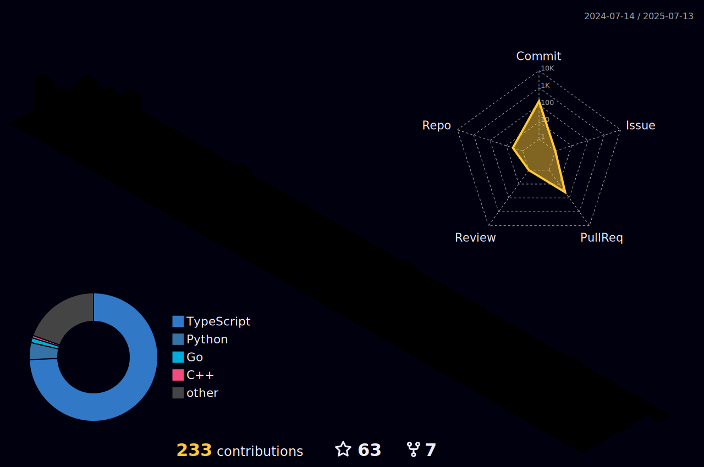

## 👋 &nbsp;About me

Hi! I'm 0xmmq, a R&D engineer in the field of cybersecurity. I used to focus mainly on blockchain-related technologies, but now I primarily work on software development related to compliance management. My future goal is to become a software engineer who can conduct development with consideration of various cybersecurity perspectives.

If you have any questions about my projects or are interested in business cooperation, feel free to DM me in English, Chinese, or Japanese. (To help me verify your message, kindly provide your complete information; otherwise, it may be mistaken for spam or a scam.)

嗨！我是 0xmmq，一名資安領域的研發工程師。過去主要關注區塊鏈相關技術，現在則主要從事與合規管理相關的軟體開發，未來的目標是成為能考量各種資安角度來進行研發的軟體工程師。

如果對我的專案有任何問題或是對商業合作感興趣，敬請以中、英或日文提供完整資訊謝謝。（若資訊不夠清晰將會視為詐欺或騷擾，敬請見諒。）

  
  
  
  
  

&nbsp;

## 📌 &nbsp;Past product

  
  
  
  
  
  
  
  
  

&nbsp;

## 🎖️ &nbsp;Certificate

  
  
  

&nbsp;

## 🔧 &nbsp;Stack

### $\color{#ce09ec}{\textsf{Language}}$

  
  
  
  
  
  

### $\color{#ce09ec}{\textsf{Frameworks}}$

  
  
  
  
  
  
  
  
  

### $\color{#ce09ec}{\textsf{Database}}$

  
  
  
  

### $\color{#ce09ec}{\textsf{Cloud Hosting}}$

  
  
  
  
  

### $\color{#ce09ec}{\textsf{Development}}$

  
  
  
  
  
  
  
  
  
  
  
  
  

&nbsp;
## 📊 &nbsp;Stats

  

&nbsp;
## ☕️ &nbsp;Payments

  
  
  

